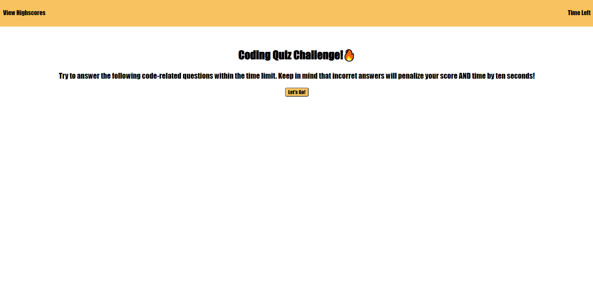

# coding-quiz
This project is incomplete. I would like the chance to revisit this project in the future. The elements that do work are due to a variable being assigned to each question with the answers to each question being stored in an array within that variable. 
A function was made for each question with the argument inside the function being made equal to the variable that stored the questions. Once the user clicked any of the buttons regardless of whether or not the right answer was selected the function for the next question was run. 
A timer was also created and would be stoped once the function for the last question was run. If the timer reached 0 before the function for the last question was run. An alert would pop up displaying "Time's Up!" and would refresh the page forcing the User to start the quiz over. 
There is also an event listener on the text "View Highscores" that can be clicked on at any point and will display the users initials and the score that they entered. 
At the very end of the quiz there is a button with the option to go back. There is an event listener on this button and once that button is clicked it refreshes the browser and allows the user to take the quiz again. 
A few errors that are in this code is that even if the user selects the correct answer, 10 seconds will still be taken of the timer as well as 10 points taken off the final score. I understand that this is happening because the buttons from each function are never really reassigned, rather they are just running in the background. Another issues is that the clear highscores button at the end of the quiz does not work. I could not figure out how to clear the items in the array and still have the users most recent entry display on the final screen. The user would have to refresh the page and click the "View Highscores" text to see their entry rather than it just displaying on the next screen once they hit submit. These are issues I hope to revisit in the future to make a full proper working application. 

Click [here] (https://nicoled1999.github.io/coding-quiz/) to go to my website.